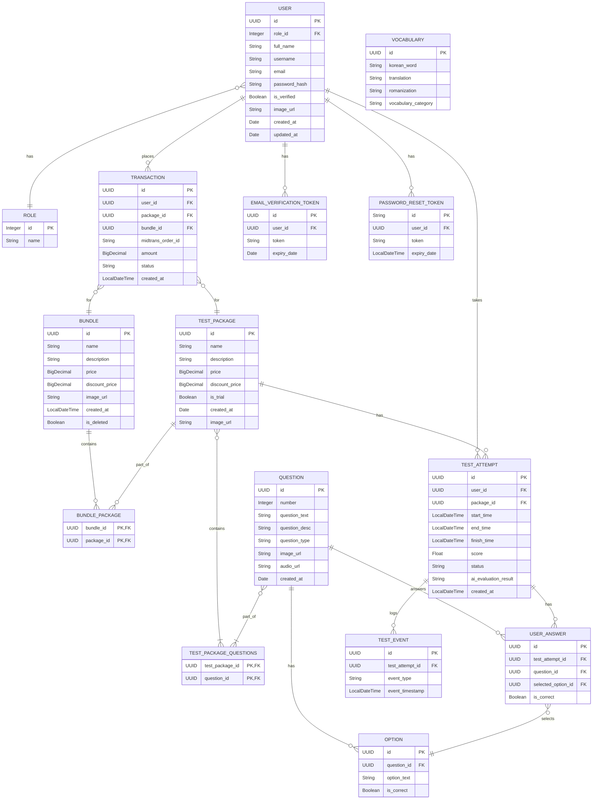

# Entity Relationship Diagram (ERD)

```mermaid
erDiagram
    USER {
        UUID id PK
        Integer role_id FK
        String full_name
        String username
        String email
        String password_hash
        Boolean is_verified
        String image_url
        Date created_at
        Date updated_at
    }

    ROLE {
        Integer id PK
        String name
    }

    TRANSACTION {
        UUID id PK
        UUID user_id FK
        UUID package_id FK
        UUID bundle_id FK
        String midtrans_order_id
        BigDecimal amount
        String status
        LocalDateTime created_at
    }

    TEST_PACKAGE {
        UUID id PK
        String name
        String description
        BigDecimal price
        BigDecimal discount_price
        Boolean is_trial
        Date created_at
        String image_url
    }

    BUNDLE {
        UUID id PK
        String name
        String description
        BigDecimal price
        BigDecimal discount_price
        String image_url
        LocalDateTime created_at
        Boolean is_deleted
    }

    BUNDLE_PACKAGE {
        UUID bundle_id PK, FK
        UUID package_id PK, FK
    }

    QUESTION {
        UUID id PK
        Integer number
        String question_text
        String question_desc
        String question_type
        String image_url
        String audio_url
        Date created_at
    }

    TEST_PACKAGE_QUESTIONS {
        UUID test_package_id PK, FK
        UUID question_id PK, FK
    }

    OPTION {
        UUID id PK
        UUID question_id FK
        String option_text
        Boolean is_correct
    }

    TEST_ATTEMPT {
        UUID id PK
        UUID user_id FK
        UUID package_id FK
        LocalDateTime start_time
        LocalDateTime end_time
        LocalDateTime finish_time
        Float score
        String status
        String ai_evaluation_result
        LocalDateTime created_at
    }

    USER_ANSWER {
        UUID id PK
        UUID test_attempt_id FK
        UUID question_id FK
        UUID selected_option_id FK
        Boolean is_correct
    }

    TEST_EVENT {
        UUID id PK
        UUID test_attempt_id FK
        String event_type
        LocalDateTime event_timestamp
    }

    EMAIL_VERIFICATION_TOKEN {
        UUID id PK
        UUID user_id FK
        String token
        Date expiry_date
    }

    PASSWORD_RESET_TOKEN {
        String id PK
        UUID user_id FK
        String token
        LocalDateTime expiry_date
    }

    VOCABULARY {
        UUID id PK
        String korean_word
        String translation
        String romanization
        String vocabulary_category
    }

    USER ||--o{ TRANSACTION : places
    USER ||--o{ TEST_ATTEMPT : takes
    USER }o--|| ROLE : has
    USER ||--o{ EMAIL_VERIFICATION_TOKEN : has
    USER ||--o{ PASSWORD_RESET_TOKEN : has

    TRANSACTION }o--|| TEST_PACKAGE : for
    TRANSACTION }o--|| BUNDLE : for

    BUNDLE ||--o{ BUNDLE_PACKAGE : contains
    TEST_PACKAGE ||--o{ BUNDLE_PACKAGE : part_of

    TEST_PACKAGE ||--o{ TEST_ATTEMPT : has
    TEST_PACKAGE }o--|{ TEST_PACKAGE_QUESTIONS : contains
    QUESTION }o--|{ TEST_PACKAGE_QUESTIONS : part_of

    QUESTION ||--o{ OPTION : has
    QUESTION ||--o{ USER_ANSWER : answers

    TEST_ATTEMPT ||--o{ USER_ANSWER : has
    TEST_ATTEMPT ||--o{ TEST_EVENT : logs

    USER_ANSWER }o--|| OPTION : selects
```
